  

<h3><code>kioxr@github ~ $ ./contributions.sh</code></h3>

  

<h3><code>kioxr@github ~ $ neofetch</code></h3>

  

<h3><code>kioxr@github ~ $ cat stack.txt</code></h3>

  

<h3><code>kioxr@github ~ $ ls projects/</code></h3>

| Project | What it is |
| --- | --- |
| 🧠 [**ResiWare**](https://github.com/kioxr/resiware) | Senior capstone (team of 4): a multi-process, multi-agent Python system (~20k lines) that ingests SIEM alerts, correlates them with a local LLM, scores risk and dispatches automated responses over an async pub/sub bus and shared SQLite. I wrote the response layer's **policy engine** (deterministic rules, hard veto and mandate, LLM limited to approved options) with 270 lines of pytest, integrated into the action agent with a deterministic guard over LLM choices. I co-wrote the fault-tolerant feedback service (queues outcomes locally and replays them when the learning API is down) and owned the UML design and project docs. `Python · Ollama · SQLite · Ansible · pytest` |
| 🌐 **Full-Stack Web App** | Express back end exposing a RESTful API with user authentication and database persistence, and a responsive front end consuming it. `Node.js · Express · REST · HTML/CSS/JS` |
| 💻 **Client–Server & Shell Automation** | Socket-based client–server program and Bash scripts automating file and process management on Linux. `Linux sockets · Bash` |
| ⚙️ **Software Engineering Team Project** | Led a team from requirements gathering through use-case and UML modelling to an Agile implementation of a complete system. `UML · Agile` |

 

<h3><code>kioxr@github ~ $ ./contact.sh</code></h3>

📫 <a href="mailto:abfmashhadani@gmail.com">abfmashhadani@gmail.com</a>

